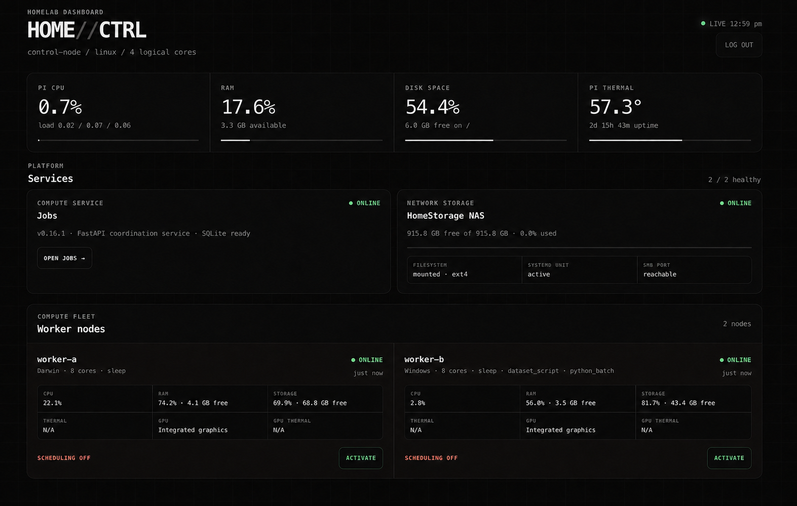
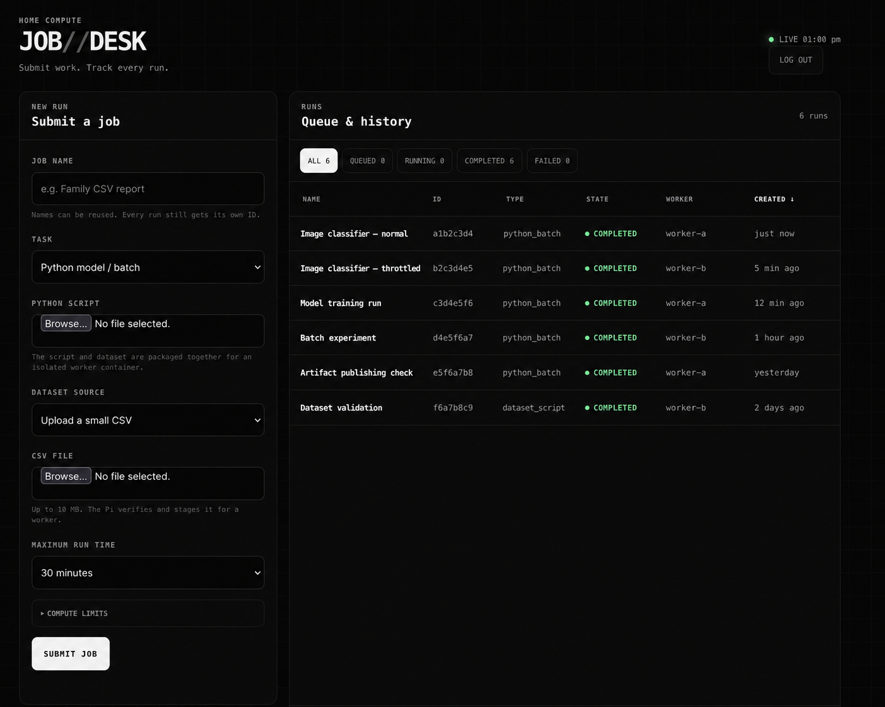

# Web Interfaces

The system has two responsive, server-rendered browser shells backed by the
same control-plane API and authenticated session. They are deliberately small:
plain HTML, CSS, and JavaScript, with no front-end build chain.

## Current interface boundary

### Dashboard

The dashboard is for the owner or operator. It shows:

- Jobs service health (the API and database presented as one service) and host
  CPU, RAM, temperature, and disk space;
- NAS mount, service, capacity, and reachability;
- registered worker state, capabilities, telemetry, current work, and last-seen
  freshness; and
- scheduling enable/disable controls plus a compact job summary.

It refreshes every 15 seconds. That is intentionally much slower than the
worker's 5-second lease heartbeat: browser freshness is a usability choice;
lease renewal is a correctness mechanism.

### Job Desk

Job Desk is for submitting and tracking work. It supports:

- named jobs and sortable job-table columns;
- deterministic best-fit placement or explicit targeting of one registered
  worker, with each worker's job ceiling shown in the selector;
- small CSV and Python uploads, or linked verified datasets;
- batch resource limits;
- status, structured failure reason, and result inspection;
- cancellation of queued or running work, with a visible pending acknowledgement; and
- artifact listing, small text preview, and per-file download.

It refreshes every 10 seconds. Current uploads are intentionally small because
they pass through the coordinator. Current artifacts are streamed individually,
with default ceilings of 100 MiB per file and 512 MiB per job.

Both screenshots use synthetic identifiers and history. They demonstrate the
interface without publishing live deployment details.

### CLI

The CLI is the stable automation surface. It supports worker inspection and
scheduling control, job submission, listing and cancellation, and artifact
listing, download, and deletion. A future UI must not introduce state
transitions that are only available in JavaScript.

## Next redesign

The next UI pass is a refinement of these boundaries, not a new control plane.
It should preserve the existing routes and progressively improve presentation.

Priorities, in order:

1. Give both pages one consistent black, terminal-inspired visual system and a
   clear Dashboard / Jobs navigation model.
2. Make mobile the constraining layout. Important state must fit an iPhone
   without horizontal table scrolling; dense tables may become cards or
   disclosure rows at narrow widths.
3. Make freshness explicit. Show when telemetry was sampled and distinguish
   ONLINE, STALE, disabled, idle, and busy without relying on colour alone.
4. Give Job Desk a clearer submission flow, useful empty/loading/error states,
   accessible sorting indicators, and a focused job-detail view.
5. Improve artifact retrieval with download-all, visible size/limit guidance,
   and progress/error feedback. Native browser downloads cannot choose an
   arbitrary destination on another device; a true server-initiated transfer is
   a separate backend feature.
6. Keep operator-only controls visually and conceptually separate from the
   future family-facing submission surface. A separate authorization role must
   exist before those audiences are actually separated.
7. Add application progress only after defining a bounded update frequency,
   monotonic progress semantics, and behavior across retries. Worker liveness is
   already represented by leases and must not be presented as task progress.

## Design constraints

- Support current Safari and Chromium layouts on phone, tablet, and desktop.
- Preserve keyboard navigation, visible focus, semantic buttons, and readable
  contrast.
- Do not expose tokens to browser JavaScript; keep the HttpOnly session flow.
- Do not make polling more frequent merely to make the page feel live.
- Do not imply that live telemetry drives scheduling. Placement uses fixed
  capacity envelopes; CPU percentage and temperature are informational.
- Prefer small enhancements over a framework migration until interface
  complexity actually requires one.
